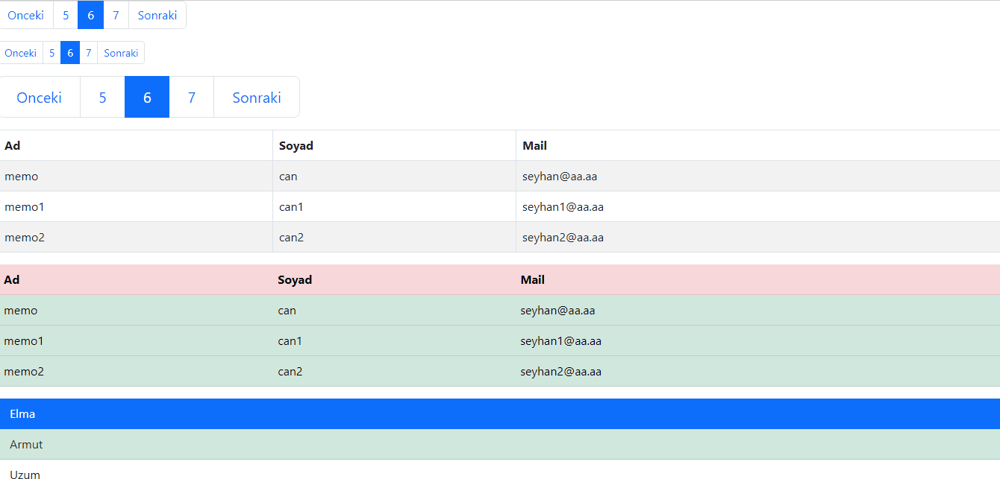

<h1>Bootstrap Test</h1>

A project in which I was testing the features of Bootstrap CDN (Content Delivery Network) which makes the life of a Front-End developer way easier by offering ready-to-go presets for CSS. Removing the necessity to manually define all elements and set them in separate CSS files.

<h2>GIF of the project</h2>

